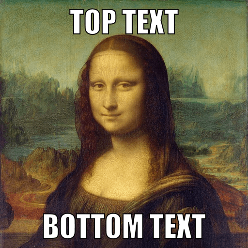
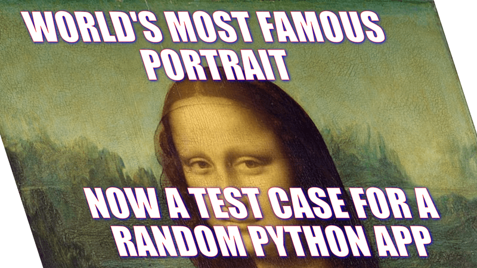

A template invoking image macros, complete with Impact font.

## Template Dimensions

512px x 512px

## Template Parameters

| Name          | Description                                              | Default                                              |
| ------------- | -------------------------------------------------------- | ---------------------------------------------------- |
| `top_text`    | Top text for the meme                                    | `"Top Text"`                                         |
| `bottom_text` | Bottom text for the meme                                 | `"Bottom Text"`                                      |
| `background`  | Image of the meme (URL or local path.)                   | [Mona Lisa](https://en.wikipedia.org/wiki/Mona_Lisa) |
| `custom_css`  | Custom CSS; refer to the raw template for HTML elements. | Empty                                                |

## Example Usage

(note: due to file-size (about 500KB per image), the images included on this page have been compressed using TinyPNG)

Set up imgmaker:

```python
from imgmaker import imgmaker

i = imgmaker()
```

No configuration:

```python
i.generate('meme')
```



Change the text. Thanks to the underlying Google Chrome and Bulma, text will wrap correctly!

```python
i.generate(
    "meme",
    {"top_text": "World's Most Famous Portrait",
     "bottom_text": "Now a test case for a random Python app"
    },
)
```


## Hack This Template!

You can change the font via CSS (to a system-installed font), plus other hacks!

This code also reproduces the image used in the repo README.

```python
i.generate(
    "meme",
    {"top_text": "World's Most Famous Portrait",
     "bottom_text": "Now a test case for a random Python app",
     "custom_css": "body {-webkit-text-stroke: 0.5px red; transform: skew(.312rad); text-shadow: 1px 1px 5px blue;}"
    },
    width=800,
    height=450,
)
```


