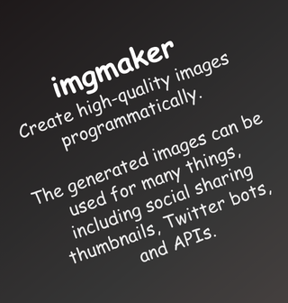

First, you can instantiate an `imgmaker` object for generation, which starts up a headless Google Chrome in the background.

```python
from imgmaker import imgmaker

i = imgmaker()
```

imgmaker contains built-in templates (you can view all the templates in the corresponding folder, with READMEs for each one). We'll use the [Hero](imgmaker/templates/hero) template; the default used if no template is specified.

```python
i.generate()
```


We can pass a dict containing template parameters. For the Hero template, we can specify the title and subtitle.

```python
i.generate(
    "hero",
    {"title": "imgmaker",
     "subtitle": "Create high-quality images programmatically"
    },
)
```


You can also alter the background `color` matching the Bulma documentation, use the `bold` background variant instead, set the image to a dynamic height to fit all the text, and/or _use custom CSS and go crazy_.

```python
i.generate(
    "hero",
    {"title": "imgmaker",
     "subtitle": "Create high-quality images programmatically.<br /><br />" +
                 "The generated images can be used for many things, " +
                 "including social sharing thumbnails, Twitter bots, and APIs.",
     "color": "dark",
     "bold": True,
     "custom_css": ".container {font-family: Comic Sans MS; transform: rotate(-20deg);}"
    },
    height = -1
)
```


